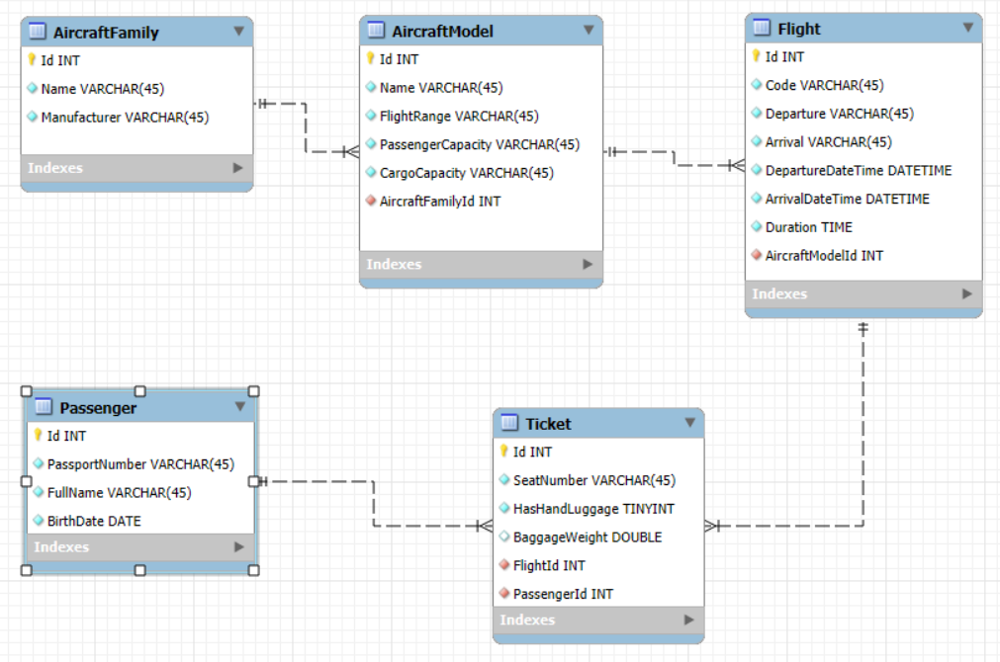

# AirlineApp Лабораторная работа 1

## Описание проекта

**AirlineApp** — учебная лабораторная работа на C# и .NET, имитирующая систему управления авиаперевозками.  
Проект реализует основные сущности авиакомпании, генерацию тестовых данных и модульные тесты для проверки логики приложения.

### Цель лабораторной работы № 1

- Изучение работы с объектно-ориентированными сущностями.  
- Освоение генерации тестовых данных.  
- Практика написания модульных тестов на xUnit.  

---

## Реализованные функциональные возможности

- **AircraftFamily** — семейство самолётов.  
- **AircraftModel** — модель самолёта, привязанная к семейству.  
- **Flight** — конкретный авиарейс с датой, временем и длительностью.  
- **Passenger** — пассажир авиакомпании.  
- **Ticket** — билет, связывающий пассажира и рейс  

### Модульные тесты проверяют:

1. Топ 5 рейсов по количеству пассажиров.  
2. Рейсы с минимальной длительностью.  
3. Пассажиров с нулевым весом багажа на конкретном рейсе.  
4. Сводную информацию по рейсам выбранной модели в заданный период.  
5. Рейсы между указанными городами.  

---

## Структура проекта
```text
AirlineApp/
├── AirlineApp.Domain/
│   └── Entities/
│       ├── AircraftFamily.cs
│       ├── AircraftModel.cs
│       ├── Flight.cs
│       ├── Passenger.cs
│       └── Ticket.cs
├── AirlineApp.Seed/
│   └── DataSeed.cs
├── AirlineApp.Tests/
    └── QueriesTests.cs
```


- **Domain** — бизнес-логика и сущности.  
- **Seed** — генерация примеров данных для тестов.  
- **Tests** — проверка корректности данных и запросов.    

---

## ER-диаграмма


